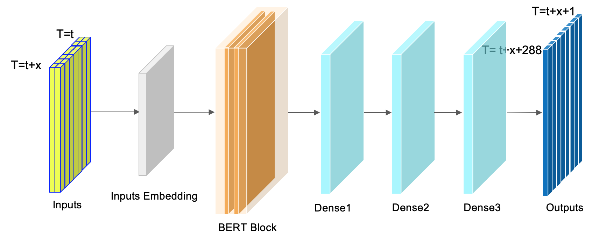

# KDD Cup 2022 - Baidu Spatial Dynamic Wind Power Forecasting

This is my solution for Baidu KDD Cup 2022, winning 3rd place in 2490 teams. 
The task is to predict the wind farm's future 48 hours active power for every 10 minutes.

<h1 align="center">

</h1><br>

## Solution summary
- A single BERT model is made from [the tfts library created by myself](https://github.com/LongxingTan/Time-series-prediction)
- Sliding window to generate more samples
- Only 2 raw features are used, wind speed and direction
- The daily fluctuation is added by post-processing to make the predicted result in line with daily periodicity

## How to reproduce it
0. Prepare the tensorflow environment
```shell
pip install -r requirements.txt
```
1. Download the data from [Baidu AI studio](https://aistudio.baidu.com/aistudio/competition/detail/152/0/introduction), and put it in `./data/raw`
2. Train the model
```shell
cd src/train
python nn_train.py
```
3. The file `result.zip` created in `./weights/` can be used for submit. 


## Contributor
- [Longxing Tan](https://github.com/LongxingTan)
- [Hongying Yue](https://github.com/hongyingyue)

## Reference
- [1] Jacob Devlin, Ming-Wei Chang, Kenton Lee, and Kristina Toutanova. 2018. Bert: Pre-training of deep bidirectional transformers for language understanding. arXiv preprint arXiv:1810.04805 (2018).
- [2] Haixu Wu, Jiehui Xu, Jianmin Wang, and Mingsheng Long. 2021. Autoformer: De-composition transformers with auto-correlation for long-term series forecasting. Advances in Neural Information Processing Systems 34 (2021), 22419–22430.
- [3] JingboZhou,ShuangliLi,LiangHuang,HaoyiXiong,FanWang,TongXu,Hui Xiong, and Dejing Dou. 2020. Distance-aware molecule graph attention network for drug-target binding affinity prediction. arXiv preprint arXiv:2012.09624 (2020).
- [4] HaoyiZhou,ShanghangZhang,JieqiPeng,ShuaiZhang,JianxinLi,HuiXiong, and Wancai Zhang. 2021. Informer: Beyond efficient transformer for long sequence time-series forecasting. In Proceedings of the AAAI Conference on Artificial Intelligence, Vol. 35. 11106–11115.
